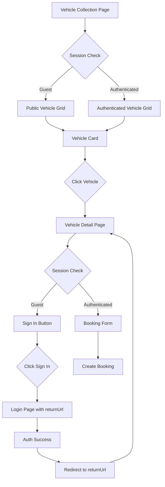

# Design Document: Guest Vehicle Browsing

## Overview

This design document specifies the technical implementation for enabling unauthenticated guest users to browse vehicles on the rental platform. Currently, all vehicle browsing functionality requires authentication, which creates a barrier to entry for potential customers. This feature will allow guests to explore the vehicle collection and view detailed vehicle information before committing to account creation, while maintaining security for sensitive operations like booking and payments.

### Goals

- Enable public access to vehicle collection and detail pages
- Maintain security for booking, payment, and profile operations
- Provide seamless authentication flow with return URL handling
- Optimize pages for search engine discoverability
- Preserve existing authenticated user experience

### Non-Goals

- Allowing guests to create bookings or make payments
- Modifying the owner vehicle management interface
- Changing the admin approval workflow
- Implementing guest session tracking or analytics

### Key Design Decisions

1. **Middleware-based Route Protection**: Use Next.js middleware configuration to selectively allow public access to specific routes while maintaining protection for sensitive operations
2. **Conditional API Authentication**: Modify vehicle API endpoints to serve APPROVED vehicles to unauthenticated requests while enforcing authentication for mutations
3. **Component-level Conditional Rendering**: Use session state to conditionally render booking forms vs sign-in CTAs
4. **Server-Side Rendering for SEO**: Leverage Next.js App Router's default SSR for public pages to ensure search engine crawlability
5. **Return URL Pattern**: Implement standard OAuth-style return URL handling for post-authentication redirects

## Architecture

### Current Architecture

The platform currently uses a role-based access control (RBAC) system with three roles:

- **ADMIN**: Full system access including vehicle approval and KYC management
- **OWNER**: Can list vehicles and manage their own inventory
- **USER/RENTER**: Can browse approved vehicles and create bookings

Authentication is enforced at multiple layers:

1. **Middleware Layer** (`src/middleware.ts`): Blocks unauthenticated access to protected routes
2. **API Layer**: Validates session tokens and enforces role-based permissions
3. **Component Layer**: Uses `useSession()` to conditionally render UI elements

All vehicle browsing currently requires authentication, with routes protected by middleware:

- `/renter/vehicles` - Vehicle collection page (protected)
- `/renter/vehicles/[id]` - Vehicle detail page (protected)
- `/api/vehicles` - Vehicle API (protected)

### Proposed Architecture Changes

#### 1. Route Structure Reorganization

Create a new public vehicle browsing route structure parallel to the authenticated renter routes:

```
app/
├── vehicles/
│   ├── page.tsx              # Public vehicle collection (currently exists, needs update)
│   └── [id]/
│       └── page.tsx          # Public vehicle detail (new)
├── (dashboard)/
│   └── renter/
│       ├── vehicles/
│       │   ├── page.tsx      # Authenticated vehicle collection
│       │   └── [id]/
│       │       └── page.tsx  # Authenticated vehicle detail (existing)
│       └── bookings/         # Protected booking management
```

**Rationale**: Separating public and authenticated routes provides clear boundaries and simplifies middleware configuration. The `/vehicles` route will be public, while `/renter/vehicles` remains protected for authenticated users.

#### 2. Middleware Configuration Update

Modify `src/middleware.ts` to exclude public vehicle routes from authentication requirements:

```typescript
export const config = {
  matcher: [
    "/admin/:path*",
    "/owner/:path*",
    "/renter/:path*",
    "/api/kyc/:path*",
    "/api/vehicles/:path*", // Will be refined to protect only mutations
    "/api/bookings/:path*",
    "/api/admin/:path*",
  ],
};
```

Add logic to allow:

- `GET /api/vehicles` (unauthenticated)
- `GET /api/vehicles/[id]` (unauthenticated)
- `/vehicles` (unauthenticated)
- `/vehicles/[id]` (unauthenticated)

While continuing to protect:

- `POST /api/vehicles` (OWNER + APPROVED KYC)
- `PATCH /api/vehicles/[id]` (OWNER + ownership)
- `DELETE /api/vehicles/[id]` (OWNER + ownership)
- All booking and payment routes

#### 3. API Layer Modifications

The vehicle API will implement conditional authentication:

```typescript
// GET /api/vehicles
// - No session: Return APPROVED vehicles only
// - USER/RENTER session: Return APPROVED vehicles only
// - OWNER session: Return own vehicles (all statuses)
// - ADMIN session: Return all vehicles (optionally filtered)

// GET /api/vehicles/[id]
// - No session: Return vehicle if status is APPROVED, else 404
// - Authenticated: Return vehicle based on role and ownership
```

This approach maintains backward compatibility while enabling public access.

#### 4. Component Architecture



### Data Flow

#### Guest User Flow

1. Guest navigates to `/vehicles`
2. Middleware allows request (public route)
3. Page component renders without session
4. Client fetches `GET /api/vehicles` (no auth header)
5. API returns APPROVED vehicles only
6. Guest clicks vehicle card
7. Navigate to `/vehicles/[id]`
8. Client fetches `GET /api/vehicles/[id]` (no auth header)
9. API returns vehicle if APPROVED, else 404
10. Page renders with "Sign in to book" button
11. Guest clicks sign-in button
12. Redirect to `/login?returnUrl=/vehicles/[id]`
13. After authentication, redirect to returnUrl

#### Authenticated User Flow

1. User navigates to `/renter/vehicles` (existing flow)
2. Middleware validates session
3. Page renders with session
4. Client fetches `GET /api/vehicles` (with auth header)
5. API returns vehicles based on role
6. User clicks vehicle card
7. Navigate to `/renter/vehicles/[id]`
8. Page renders with booking form
9. User creates booking (existing flow)

## Components and Interfaces

### 1. Public Vehicle Collection Page

**Location**: `app/vehicles/page.tsx`

**Purpose**: Display vehicle collection to unauthenticated users

**Key Changes**:

- Remove authentication requirement
- Fetch vehicles from public API endpoint
- Display only APPROVED vehicles
- Maintain filtering and sorting functionality
- Update navigation links to point to public detail pages

**Component Structure**:

```typescript
export default function PublicVehiclesPage() {
  const [vehicles, setVehicles] = useState<Vehicle[]>([]);
  const [filters, setFilters] = useState({ location: '', minPrice: 0, maxPrice: Infinity });

  // Fetch vehicles without authentication
  useEffect(() => {
    fetch('/api/vehicles?' + new URLSearchParams(filters))
      .then(res => res.json())
      .then(data => setVehicles(data.vehicles));
  }, [filters]);

  return (
    <div>
      <VehicleFilters onChange={setFilters} />
      <VehicleGrid vehicles={vehicles} linkPrefix="/vehicles" />
    </div>
  );
}
```

### 2. Public Vehicle Detail Page

**Location**: `app/vehicles/[id]/page.tsx`

**Purpose**: Display vehicle details to unauthenticated users with sign-in CTA

**Key Features**:

- Fetch vehicle details without authentication
- Display complete vehicle information
- Show feedback and ratings
- Render "Sign in to book" button instead of booking form
- Handle 404 for non-APPROVED vehicles

**Component Structure**:

```typescript
export default function PublicVehicleDetailPage() {
  const params = useParams();
  const [vehicle, setVehicle] = useState<Vehicle | null>(null);
  const [error, setError] = useState<string>('');

  useEffect(() => {
    fetch(`/api/vehicles/${params.id}`)
      .then(res => {
        if (!res.ok) throw new Error('Vehicle not found');
        return res.json();
      })
      .then(data => setVehicle(data.vehicle))
      .catch(err => setError(err.message));
  }, [params.id]);

  if (error) return <NotFoundPage />;
  if (!vehicle) return <LoadingState />;

  return (
    <div>
      <VehicleDetails vehicle={vehicle} />
      <FeedbackList vehicleId={vehicle.id} />
      <SignInToBookButton vehicleId={vehicle.id} />
    </div>
  );
}
```

### 3. Sign In Button Component

**Location**: `src/features/vehicles/components/SignInToBookButton.tsx` (new)

**Purpose**: Provide clear CTA for guests to authenticate

**Props**:

```typescript
interface SignInToBookButtonProps {
  vehicleId: string;
}
```

**Implementation**:

```typescript
export function SignInToBookButton({ vehicleId }: SignInToBookButtonProps) {
  const router = useRouter();

  const handleClick = () => {
    const returnUrl = `/vehicles/${vehicleId}`;
    router.push(`/login?returnUrl=${encodeURIComponent(returnUrl)}`);
  };

  return (
    <div className="bg-white rounded-lg shadow-md p-6 sticky top-6">
      <button
        onClick={handleClick}
        className="w-full bg-blue-600 text-white py-3 px-4 rounded-md hover:bg-blue-700 transition-colors font-semibold"
      >
        Sign in to book
      </button>
      <p className="mt-3 text-sm text-gray-600 text-center">
        Create an account or sign in to book this vehicle
      </p>
    </div>
  );
}
```

### 4. Conditional Vehicle Detail Wrapper

**Purpose**: Render appropriate UI based on authentication state

**Implementation Strategy**:

- Keep existing authenticated page at `/renter/vehicles/[id]`
- Create new public page at `/vehicles/[id]`
- Share common components (VehicleDetails, FeedbackList)
- Differ only in booking section (BookingForm vs SignInButton)

### 5. Updated Middleware

**Location**: `src/middleware.ts`

**Key Changes**:

```typescript
export async function middleware(request: NextRequest) {
  const token = await getToken({ req: request });
  const { pathname } = request.nextUrl;

  // Public routes - allow access without authentication
  if (
    pathname.startsWith("/login") ||
    pathname.startsWith("/register") ||
    pathname.startsWith("/api/auth/register") ||
    pathname.startsWith("/vehicles") || // NEW: Public vehicle browsing
    pathname === "/api/vehicles" || // NEW: Public vehicle list API
    pathname.match(/^\/api\/vehicles\/[^/]+$/) // NEW: Public vehicle detail API
  ) {
    // For API routes, allow GET requests without auth
    if (pathname.startsWith("/api/vehicles")) {
      if (request.method === "GET") {
        return NextResponse.next();
      }
      // Non-GET requests require authentication
      if (!token) {
        return NextResponse.json(
          { error: "Authentication required" },
          { status: 401 },
        );
      }
    }
    return NextResponse.next();
  }

  // Rest of middleware logic remains unchanged...
}
```

### 6. Updated Vehicle API Routes

**Location**: `app/api/vehicles/route.ts`

**GET Handler Changes**:

```typescript
export async function GET(request: NextRequest) {
  try {
    const session = await auth();
    const { searchParams } = new URL(request.url);

    const location = searchParams.get("location") || undefined;
    const minPrice = searchParams.get("minPrice")
      ? parseFloat(searchParams.get("minPrice")!)
      : undefined;
    const maxPrice = searchParams.get("maxPrice")
      ? parseFloat(searchParams.get("maxPrice")!)
      : undefined;

    // NEW: If no session (guest user), return only APPROVED vehicles
    if (!session?.user) {
      const vehicles = await vehicleService.getApprovedVehicles({
        location,
        minPrice,
        maxPrice,
      });
      return NextResponse.json({ vehicles });
    }

    // Existing authenticated logic remains unchanged...
  }
}
```

**Location**: `app/api/vehicles/[id]/route.ts`

**GET Handler Changes**:

```typescript
export async function GET(
  request: NextRequest,
  { params }: { params: { id: string } }
) {
  try {
    const session = await auth();
    const vehicleId = params.id;

    // NEW: If no session, only return APPROVED vehicles
    if (!session?.user) {
      const vehicle = await prisma.vehicle.findUnique({
        where: {
          id: vehicleId,
          status: VehicleStatus.APPROVED  // Only APPROVED for guests
        },
        include: {
          owner: {
            select: { id: true, email: true }
          },
          feedbacks: {
            include: {
              renter: {
                select: { email: true }
              }
            }
          }
        }
      });

      if (!vehicle) {
        return NextResponse.json(
          { error: "Vehicle not found" },
          { status: 404 }
        );
      }

      const averageRating = calculateAverageRating(vehicle.feedbacks);
      return NextResponse.json({ vehicle, averageRating });
    }

    // Existing authenticated logic remains unchanged...
  }
}
```

## Data Models

No database schema changes are required. The existing models support this feature:

### Vehicle Model (Existing)

```prisma
model Vehicle {
  id           String         @id @default(cuid())
  make         String
  model        String
  year         Int
  pricePerDay  Float
  location     String
  description  String?
  images       String[]
  status       VehicleStatus  @default(PENDING)
  ownerId      String
  owner        User           @relation(fields: [ownerId], references: [id])
  bookings     Booking[]
  feedbacks    Feedback[]
  createdAt    DateTime       @default(now())
  updatedAt    DateTime       @updatedAt
}

enum VehicleStatus {
  PENDING
  APPROVED
  REJECTED
  AWAITING_PAYMENT
}
```

**Key Field for Guest Access**: `status`

- Only vehicles with `status: APPROVED` will be visible to guests
- This ensures quality control and prevents unapproved listings from being public

### User Model (Existing)

No changes required. The authentication system continues to use the existing User model.

### Feedback Model (Existing)

```prisma
model Feedback {
  id         String   @id @default(cuid())
  rating     Int
  comment    String?
  vehicleId  String
  vehicle    Vehicle  @relation(fields: [vehicleId], references: [id])
  renterId   String
  renter     User     @relation(fields: [renterId], references: [id])
  createdAt  DateTime @default(now())
}
```

Feedback will be visible to guests on vehicle detail pages, providing social proof and helping inform booking decisions.

## Correctness Properties

_A property is a characteristic or behavior that should hold true across all valid executions of a system—essentially, a formal statement about what the system should do. Properties serve as the bridge between human-readable specifications and machine-verifiable correctness guarantees._

### Property Reflection

After analyzing all acceptance criteria, the following redundancies were identified and resolved:

- **Redundancy 1**: Requirements 1.5 and 5.1 both test that unauthenticated API requests return only APPROVED vehicles. These are combined into Property 1.
- **Redundancy 2**: Requirements 2.1 and 2.5 both test that vehicle detail pages are accessible without authentication. These are combined into a single example test.
- **Redundancy 3**: Requirements 5.4 and 6.6 both test that non-GET vehicle API operations require authentication. These are combined into Property 5.
- **Redundancy 4**: Requirements 3.1 and 3.3 test opposite sides of the same conditional rendering logic. These are combined into Property 3.
- **Redundancy 5**: Requirements 9.2 and 3.3 test the same behavior (authenticated users see booking form). Property 3 covers both.
- **Redundancy 6**: Requirements 5.3 and 10.2 both test that non-APPROVED vehicles return 404 for guests. These are combined into Property 2.

### Property 1: Guest API requests return only approved vehicles

_For any_ unauthenticated GET request to the vehicle collection API, all returned vehicles SHALL have status APPROVED.

**Validates: Requirements 1.5, 5.1**

### Property 2: Non-approved vehicles are hidden from guests

_For any_ vehicle with status other than APPROVED, when a guest user requests that vehicle via the API, the system SHALL return a 404 Not Found error.

**Validates: Requirements 5.2, 5.3, 10.2**

### Property 3: Conditional booking interface rendering

_For any_ vehicle detail page, the system SHALL display a Sign_In_Button when accessed without authentication AND SHALL display the Booking_Form when accessed with authentication.

**Validates: Requirements 3.1, 3.3, 9.2**

### Property 4: Return URL preservation through authentication

_For any_ vehicle detail page URL, when a guest clicks the sign-in button, the resulting login URL SHALL contain a returnUrl parameter with the original vehicle detail page URL, and after successful authentication, the system SHALL redirect to that returnUrl.

**Validates: Requirements 4.1, 4.2, 4.4**

### Property 5: Mutation operations require authentication

_For any_ non-GET HTTP request (POST, PATCH, DELETE) to vehicle API endpoints, the system SHALL return 401 Unauthorized when no authentication token is present.

**Validates: Requirements 5.4, 6.6, 7.4, 7.5, 7.6**

### Property 6: Vehicle data format consistency

_For any_ APPROVED vehicle, the response format from the API SHALL be identical whether the request is authenticated or unauthenticated.

**Validates: Requirements 5.5**

### Property 7: Protected routes remain protected

_For any_ booking, payment, or profile route, unauthenticated requests SHALL be rejected with 401 Unauthorized or redirected to login.

**Validates: Requirements 6.5, 7.1, 7.2, 7.3, 7.7**

### Property 8: Vehicle collection displays required fields

_For any_ vehicle in the collection view, the rendered output SHALL contain the vehicle's image, make, model, year, price per day, and location.

**Validates: Requirements 1.2**

### Property 9: Vehicle detail displays complete information

_For any_ vehicle in the detail view, the rendered output SHALL contain images, specifications, pricing, location, availability, feedback, and average rating.

**Validates: Requirements 2.2, 2.3**

### Property 10: Average rating calculation

_For any_ vehicle with feedback, the displayed average rating SHALL equal the arithmetic mean of all feedback ratings for that vehicle.

**Validates: Requirements 2.4**

### Property 11: Filtering returns matching vehicles

_For any_ combination of location and price range filters, all returned vehicles SHALL match the specified filter criteria (location equals the filter location if specified, and price per day is within the min/max range if specified).

**Validates: Requirements 1.3**

### Property 12: Sorting orders vehicles correctly

_For any_ sort parameter (price or year), the returned vehicle list SHALL be ordered according to that parameter in ascending or descending order as specified.

**Validates: Requirements 1.4**

### Property 13: Dynamic meta tags contain vehicle information

_For any_ vehicle detail page, the meta tags SHALL contain vehicle-specific information including the vehicle's make, model, year, and price.

**Validates: Requirements 8.2**

### Property 14: Server-side rendering includes content

_For any_ public vehicle page, the initial HTML response SHALL contain vehicle data (not just a loading state or client-side placeholder).

**Validates: Requirements 8.4**

### Property 15: Authenticated user experience preservation

_For any_ authenticated user with OWNER role, the vehicle API SHALL return their own vehicles (all statuses), and for RENTER role, SHALL return only APPROVED vehicles, maintaining backward compatibility.

**Validates: Requirements 9.1, 9.3, 9.5**

### Property 16: Error logging

_For any_ error that occurs during vehicle browsing operations, the system SHALL write an error log entry containing the error details.

**Validates: Requirements 10.5**

## Error Handling

### 1. Vehicle Not Found (404)

**Scenarios**:

- Guest requests a non-existent vehicle ID
- Guest requests a vehicle with non-APPROVED status (PENDING, REJECTED, AWAITING_PAYMENT)
- Authenticated user requests a vehicle that doesn't exist

**Implementation**:

```typescript
// API Layer
if (!vehicle || (vehicle.status !== 'APPROVED' && !session?.user)) {
  return NextResponse.json(
    { error: "Vehicle not found" },
    { status: 404 }
  );
}

// Component Layer
if (error === "Vehicle not found") {
  return (
    <NotFoundPage
      title="Vehicle Not Found"
      message="The vehicle you're looking for doesn't exist or is no longer available."
      actionLabel="Browse All Vehicles"
      actionHref="/vehicles"
    />
  );
}
```

### 2. Authentication Required (401)

**Scenarios**:

- Guest attempts to create a booking
- Guest attempts to POST/PATCH/DELETE vehicle
- Guest attempts to access payment endpoints
- Guest attempts to access profile endpoints

**Implementation**:

```typescript
// API Layer
if (!session?.user && requiresAuth(request)) {
  return NextResponse.json(
    { error: "Authentication required" },
    { status: 401 },
  );
}

// Component Layer - Prevent client-side attempts
// Show sign-in button instead of booking form for guests
```

### 3. API Failure (500)

**Scenarios**:

- Database connection failure
- External service timeout
- Unexpected server error

**Implementation**:

```typescript
// API Layer
try {
  // ... operation
} catch (error) {
  console.error("Error fetching vehicles:", error);
  // Log to monitoring service
  logger.error("Vehicle fetch failed", { error, userId: session?.user?.id });

  return NextResponse.json(
    { error: "Internal server error" },
    { status: 500 }
  );
}

// Component Layer
if (error === "Internal server error") {
  return (
    <ErrorState
      message="Something went wrong while loading vehicles."
      action={
        <button onClick={retry} className="btn-primary">
          Try Again
        </button>
      }
    />
  );
}
```

### 4. Empty Results

**Scenarios**:

- No vehicles match the applied filters
- No vehicles exist in the system (edge case)

**Implementation**:

```typescript
// Component Layer
if (vehicles.length === 0 && hasActiveFilters) {
  return (
    <EmptyState
      icon={<SearchIcon />}
      title="No vehicles found"
      message="Try adjusting your filters to see more results."
      action={
        <button onClick={clearFilters} className="btn-secondary">
          Clear Filters
        </button>
      }
    />
  );
}

if (vehicles.length === 0) {
  return (
    <EmptyState
      icon={<CarIcon />}
      title="No vehicles available"
      message="Check back soon for new listings."
    />
  );
}
```

### 5. Invalid Filter Parameters

**Scenarios**:

- Invalid price range (minPrice > maxPrice)
- Invalid date format
- Malformed query parameters

**Implementation**:

```typescript
// API Layer - Validation
const minPrice = searchParams.get("minPrice");
const maxPrice = searchParams.get("maxPrice");

if (minPrice && maxPrice && parseFloat(minPrice) > parseFloat(maxPrice)) {
  return NextResponse.json(
    { error: "Invalid price range: minimum cannot exceed maximum" },
    { status: 400 }
  );
}

// Component Layer - Prevent invalid input
<input
  type="number"
  min="0"
  value={minPrice}
  onChange={(e) => {
    const value = Math.max(0, parseFloat(e.target.value));
    setMinPrice(value);
  }}
/>
```

### 6. Network Errors

**Scenarios**:

- Client loses internet connection
- Request timeout
- CORS issues (development)

**Implementation**:

```typescript
// Component Layer
const fetchVehicles = async () => {
  try {
    const response = await fetch("/api/vehicles", {
      signal: AbortSignal.timeout(10000), // 10 second timeout
    });

    if (!response.ok) {
      throw new Error(`HTTP ${response.status}`);
    }

    const data = await response.json();
    setVehicles(data.vehicles);
  } catch (error) {
    if (error.name === "AbortError") {
      setError("Request timed out. Please check your connection.");
    } else if (error.name === "TypeError") {
      setError("Network error. Please check your internet connection.");
    } else {
      setError("Failed to load vehicles. Please try again.");
    }
  }
};
```

### Error Logging Strategy

All errors will be logged with appropriate context for debugging and monitoring:

```typescript
// Centralized error logger
export function logError(
  error: Error,
  context: {
    userId?: string;
    vehicleId?: string;
    operation: string;
    isGuest: boolean;
  },
) {
  console.error(`[${context.operation}]`, {
    message: error.message,
    stack: error.stack,
    ...context,
    timestamp: new Date().toISOString(),
  });

  // Send to monitoring service (e.g., Sentry, DataDog)
  if (process.env.NODE_ENV === "production") {
    monitoringService.captureException(error, context);
  }
}
```

## Testing Strategy

### Dual Testing Approach

This feature will be validated using both unit tests and property-based tests:

- **Unit tests**: Verify specific examples, edge cases, and error conditions
- **Property tests**: Verify universal properties across all inputs

Together, these provide comprehensive coverage where unit tests catch concrete bugs and property tests verify general correctness.

### Property-Based Testing

**Library**: `fast-check` (already installed in the project)

**Configuration**: Each property test will run a minimum of 100 iterations to ensure comprehensive input coverage.

**Test Organization**: Property tests will be co-located with the code they test, in `*.test.ts` files.

**Tagging Convention**: Each property test must include a comment referencing the design document property:

```typescript
/**
 * Feature: guest-vehicle-browsing, Property 1: Guest API requests return only approved vehicles
 */
test("unauthenticated vehicle API requests return only APPROVED vehicles", async () => {
  await fc.assert(
    fc.asyncProperty(
      fc.array(vehicleArbitrary(), { minLength: 1, maxLength: 20 }),
      async (vehicles) => {
        // Test implementation
      },
    ),
    { numRuns: 100 },
  );
});
```

### Property Test Specifications

#### Property 1: Guest API requests return only approved vehicles

```typescript
/**
 * Feature: guest-vehicle-browsing, Property 1: Guest API requests return only approved vehicles
 */
test("unauthenticated vehicle API requests return only APPROVED vehicles", async () => {
  await fc.assert(
    fc.asyncProperty(
      fc.array(vehicleArbitrary(), { minLength: 1, maxLength: 20 }),
      async (vehicles) => {
        // Seed database with vehicles of mixed statuses
        await seedVehicles(vehicles);

        // Make unauthenticated request
        const response = await fetch("/api/vehicles");
        const data = await response.json();

        // Verify all returned vehicles are APPROVED
        expect(data.vehicles.every((v) => v.status === "APPROVED")).toBe(true);
      },
    ),
    { numRuns: 100 },
  );
});
```

#### Property 2: Non-approved vehicles are hidden from guests

```typescript
/**
 * Feature: guest-vehicle-browsing, Property 2: Non-approved vehicles are hidden from guests
 */
test("non-APPROVED vehicles return 404 for guest requests", async () => {
  await fc.assert(
    fc.asyncProperty(
      vehicleArbitrary().filter((v) => v.status !== "APPROVED"),
      async (vehicle) => {
        // Create vehicle with non-APPROVED status
        const created = await createVehicle(vehicle);

        // Make unauthenticated request
        const response = await fetch(`/api/vehicles/${created.id}`);

        // Verify 404 response
        expect(response.status).toBe(404);
      },
    ),
    { numRuns: 100 },
  );
});
```

#### Property 3: Conditional booking interface rendering

```typescript
/**
 * Feature: guest-vehicle-browsing, Property 3: Conditional booking interface rendering
 */
test("vehicle detail page shows sign-in button for guests and booking form for authenticated users", async () => {
  await fc.assert(
    fc.asyncProperty(approvedVehicleArbitrary(), async (vehicle) => {
      const created = await createVehicle(vehicle);

      // Test guest view
      const guestResponse = await fetch(`/vehicles/${created.id}`);
      const guestHtml = await guestResponse.text();
      expect(guestHtml).toContain("Sign in to book");
      expect(guestHtml).not.toContain("booking-form");

      // Test authenticated view
      const authResponse = await fetch(`/renter/vehicles/${created.id}`, {
        headers: { Cookie: await getAuthCookie() },
      });
      const authHtml = await authResponse.text();
      expect(authHtml).toContain("booking-form");
      expect(authHtml).not.toContain("Sign in to book");
    }),
    { numRuns: 100 },
  );
});
```

#### Property 4: Return URL preservation through authentication

```typescript
/**
 * Feature: guest-vehicle-browsing, Property 4: Return URL preservation through authentication
 */
test("authentication flow preserves return URL", async () => {
  await fc.assert(
    fc.asyncProperty(approvedVehicleArbitrary(), async (vehicle) => {
      const created = await createVehicle(vehicle);
      const vehicleUrl = `/vehicles/${created.id}`;

      // Verify sign-in link includes returnUrl
      const response = await fetch(vehicleUrl);
      const html = await response.text();
      const returnUrl = encodeURIComponent(vehicleUrl);
      expect(html).toContain(`/login?returnUrl=${returnUrl}`);

      // Verify post-auth redirect
      const loginResponse = await fetch(`/login?returnUrl=${returnUrl}`, {
        method: "POST",
        body: JSON.stringify({
          email: "test@example.com",
          password: "password",
        }),
      });
      expect(loginResponse.headers.get("Location")).toBe(vehicleUrl);
    }),
    { numRuns: 100 },
  );
});
```

#### Property 5: Mutation operations require authentication

```typescript
/**
 * Feature: guest-vehicle-browsing, Property 5: Mutation operations require authentication
 */
test("non-GET vehicle API requests require authentication", async () => {
  await fc.assert(
    fc.asyncProperty(
      fc.constantFrom("POST", "PATCH", "DELETE"),
      vehicleArbitrary(),
      async (method, vehicle) => {
        const response = await fetch("/api/vehicles", {
          method,
          body: JSON.stringify(vehicle),
        });

        expect(response.status).toBe(401);
      },
    ),
    { numRuns: 100 },
  );
});
```

#### Property 11: Filtering returns matching vehicles

```typescript
/**
 * Feature: guest-vehicle-browsing, Property 11: Filtering returns matching vehicles
 */
test("vehicle filtering returns only matching vehicles", async () => {
  await fc.assert(
    fc.asyncProperty(
      fc.array(approvedVehicleArbitrary(), { minLength: 10, maxLength: 50 }),
      fc.string(),
      fc.float({ min: 0, max: 1000 }),
      fc.float({ min: 0, max: 1000 }),
      async (vehicles, location, minPrice, maxPrice) => {
        await seedVehicles(vehicles);

        const params = new URLSearchParams({
          location,
          minPrice: minPrice.toString(),
          maxPrice: Math.max(minPrice, maxPrice).toString(),
        });

        const response = await fetch(`/api/vehicles?${params}`);
        const data = await response.json();

        // Verify all returned vehicles match filters
        expect(
          data.vehicles.every(
            (v) =>
              v.location === location &&
              v.pricePerDay >= minPrice &&
              v.pricePerDay <= Math.max(minPrice, maxPrice),
          ),
        ).toBe(true);
      },
    ),
    { numRuns: 100 },
  );
});
```

### Unit Test Specifications

Unit tests will focus on specific examples, edge cases, and integration points:

#### Example Tests

```typescript
describe('Guest Vehicle Browsing', () => {
  test('guest can access /vehicles without authentication', async () => {
    const response = await fetch('/vehicles');
    expect(response.status).toBe(200);
  });

  test('guest can access /vehicles/[id] without authentication', async () => {
    const vehicle = await createApprovedVehicle();
    const response = await fetch(`/vehicles/${vehicle.id}`);
    expect(response.status).toBe(200);
  });

  test('sign-in button displays correct text', async () => {
    const vehicle = await createApprovedVehicle();
    const response = await fetch(`/vehicles/${vehicle.id}`);
    const html = await response.text();
    expect(html).toContain('Sign in to book');
  });

  test('login without returnUrl redirects to default page', async () => {
    const response = await fetch('/login', {
      method: 'POST',
      body: JSON.stringify({ email: 'test@example.com', password: 'password' })
    });
    expect(response.headers.get('Location')).toBe('/renter');
  });

  test('vehicle collection page includes SEO meta tags', async () => {
    const response = await fetch('/vehicles');
    const html = await response.text();
    expect(html).toContain('<meta name="description"');
    expect(html).toContain('<meta property="og:title"');
  });

  test('vehicle detail page includes structured data', async () => {
    const vehicle = await createApprovedVehicle();
    const response = await fetch(`/vehicles/${vehicle.id}`);
    const html = await response.text();
    expect(html).toContain('application/ld+json');
    expect(html).toContain('"@type": "Product"');
  });

  test('non-existent vehicle returns 404 with link to collection', async () => {
    const response = await fetch('/vehicles/non-existent-id');
    expect(response.status).toBe(404);
    const html = await response.text();
    expect(html).toContain('href="/vehicles"');
  });

  test('API failure shows retry button', async () => {
    // Mock API failure
    jest.spyOn(global, 'fetch').mockRejectedValueOnce(new Error('Network error'));

    render(<VehiclesPage />);
    await waitFor(() => {
      expect(screen.getByText(/try again/i)).toBeInTheDocument();
    });
  });

  test('empty filter results show clear filters button', async () => {
    await seedVehicles([]);
    render(<VehiclesPage />);

    // Apply filters that return no results
    fireEvent.change(screen.getByLabelText(/location/i), { target: { value: 'NonexistentCity' } });

    await waitFor(() => {
      expect(screen.getByText(/no vehicles found/i)).toBeInTheDocument();
      expect(screen.getByText(/clear filters/i)).toBeInTheDocument();
    });
  });
});

describe('Protected Operations', () => {
  test('booking creation requires authentication', async () => {
    const response = await fetch('/api/bookings', {
      method: 'POST',
      body: JSON.stringify({ vehicleId: 'test-id', startDate: '2024-01-01', endDate: '2024-01-05' })
    });
    expect(response.status).toBe(401);
  });

  test('payment operations require authentication', async () => {
    const response = await fetch('/api/payments', { method: 'POST' });
    expect(response.status).toBe(401);
  });

  test('profile operations require authentication', async () => {
    const response = await fetch('/api/profile', { method: 'GET' });
    expect(response.status).toBe(401);
  });

  test('vehicle creation requires authentication', async () => {
    const response = await fetch('/api/vehicles', {
      method: 'POST',
      body: JSON.stringify({ make: 'Tesla', model: 'Model 3', year: 2024 })
    });
    expect(response.status).toBe(401);
  });
});
```

#### Edge Cases

```typescript
describe('Edge Cases', () => {
  test('vehicle with empty images array shows placeholder', async () => {
    const vehicle = await createApprovedVehicle({ images: [] });
    const response = await fetch(`/vehicles/${vehicle.id}`);
    const html = await response.text();
    expect(html).toContain('No images available');
  });

  test('vehicle with no feedback shows 0.0 rating', async () => {
    const vehicle = await createApprovedVehicle();
    const response = await fetch(`/api/vehicles/${vehicle.id}`);
    const data = await response.json();
    expect(data.averageRating).toBe(0);
  });

  test('extremely long vehicle description is truncated in card view', async () => {
    const longDescription = 'a'.repeat(1000);
    const vehicle = await createApprovedVehicle({ description: longDescription });
    render(<VehicleCard vehicle={vehicle} />);
    const displayedText = screen.getByText(/a+/);
    expect(displayedText.textContent.length).toBeLessThan(200);
  });

  test('special characters in location are properly encoded in URL', async () => {
    const location = 'São Paulo, Brazil';
    const response = await fetch(`/api/vehicles?location=${encodeURIComponent(location)}`);
    expect(response.status).toBe(200);
  });
});
```

### Test Coverage Goals

- **Line Coverage**: Minimum 80% for new code
- **Branch Coverage**: Minimum 75% for conditional logic
- **Property Test Coverage**: All 16 correctness properties must have corresponding property tests
- **Integration Test Coverage**: All API endpoints must have integration tests

### Testing Tools

- **Unit Testing**: Jest + React Testing Library
- **Property Testing**: fast-check
- **Integration Testing**: Supertest for API testing
- **E2E Testing**: Playwright (optional, for critical user flows)

### Continuous Integration

All tests must pass before merging:

```yaml
# .github/workflows/test.yml
name: Test
on: [push, pull_request]
jobs:
  test:
    runs-on: ubuntu-latest
    steps:
      - uses: actions/checkout@v2
      - uses: actions/setup-node@v2
      - run: npm install
      - run: npm run test:unit
      - run: npm run test:property
      - run: npm run test:integration
```

## SEO Optimization

### Meta Tags Implementation

#### Vehicle Collection Page

```typescript
// app/vehicles/page.tsx
export const metadata: Metadata = {
  title: "Browse Premium Vehicles | RentRide",
  description:
    "Explore our collection of luxury vehicles, sports cars, and premium SUVs available for rent. Find the perfect vehicle for your next adventure.",
  openGraph: {
    title: "Browse Premium Vehicles | RentRide",
    description:
      "Explore our collection of luxury vehicles, sports cars, and premium SUVs available for rent.",
    type: "website",
    url: "https://rentride.com/vehicles",
    images: [
      {
        url: "https://rentride.com/og-vehicles.jpg",
        width: 1200,
        height: 630,
        alt: "RentRide Vehicle Collection",
      },
    ],
  },
  twitter: {
    card: "summary_large_image",
    title: "Browse Premium Vehicles | RentRide",
    description:
      "Explore our collection of luxury vehicles, sports cars, and premium SUVs available for rent.",
    images: ["https://rentride.com/og-vehicles.jpg"],
  },
  alternates: {
    canonical: "https://rentride.com/vehicles",
  },
};
```

#### Vehicle Detail Page (Dynamic)

```typescript
// app/vehicles/[id]/page.tsx
export async function generateMetadata({
  params,
}: {
  params: { id: string };
}): Promise<Metadata> {
  const vehicle = await fetchVehicle(params.id);

  if (!vehicle) {
    return {
      title: "Vehicle Not Found | RentRide",
    };
  }

  const title = `${vehicle.year} ${vehicle.make} ${vehicle.model} - Rent for Rs.${vehicle.pricePerDay}/day`;
  const description =
    vehicle.description ||
    `Rent a ${vehicle.year} ${vehicle.make} ${vehicle.model} in ${vehicle.location}. Available for Rs.${vehicle.pricePerDay} per day.`;

  return {
    title,
    description,
    openGraph: {
      title,
      description,
      type: "product",
      url: `https://rentride.com/vehicles/${vehicle.id}`,
      images: vehicle.images.map((img) => ({
        url: img,
        width: 1200,
        height: 630,
        alt: `${vehicle.make} ${vehicle.model}`,
      })),
    },
    twitter: {
      card: "summary_large_image",
      title,
      description,
      images: vehicle.images,
    },
    alternates: {
      canonical: `https://rentride.com/vehicles/${vehicle.id}`,
    },
  };
}
```

### Structured Data (JSON-LD)

Implement Schema.org Product markup for vehicle listings:

```typescript
// app/vehicles/[id]/page.tsx
function generateStructuredData(vehicle: Vehicle, averageRating: number, feedbackCount: number) {
  return {
    '@context': 'https://schema.org',
    '@type': 'Product',
    name: `${vehicle.year} ${vehicle.make} ${vehicle.model}`,
    description: vehicle.description,
    image: vehicle.images,
    brand: {
      '@type': 'Brand',
      name: vehicle.make
    },
    offers: {
      '@type': 'Offer',
      price: vehicle.pricePerDay,
      priceCurrency: 'INR',
      availability: 'https://schema.org/InStock',
      priceSpecification: {
        '@type': 'UnitPriceSpecification',
        price: vehicle.pricePerDay,
        priceCurrency: 'INR',
        unitText: 'DAY'
      }
    },
    aggregateRating: feedbackCount > 0 ? {
      '@type': 'AggregateRating',
      ratingValue: averageRating,
      reviewCount: feedbackCount,
      bestRating: 5,
      worstRating: 1
    } : undefined,
    additionalProperty: [
      {
        '@type': 'PropertyValue',
        name: 'Year',
        value: vehicle.year
      },
      {
        '@type': 'PropertyValue',
        name: 'Location',
        value: vehicle.location
      }
    ]
  };
}

// In component
<script
  type="application/ld+json"
  dangerouslySetInnerHTML={{
    __html: JSON.stringify(generateStructuredData(vehicle, averageRating, feedbackCount))
  }}
/>
```

### Server-Side Rendering

Next.js App Router provides SSR by default. Ensure data fetching happens server-side:

```typescript
// app/vehicles/[id]/page.tsx
async function fetchVehicle(id: string) {
  // Server-side fetch (no authentication needed for APPROVED vehicles)
  const response = await fetch(`${process.env.NEXT_PUBLIC_API_URL}/api/vehicles/${id}`, {
    cache: 'no-store' // or use revalidate for ISR
  });

  if (!response.ok) {
    return null;
  }

  return response.json();
}

export default async function VehicleDetailPage({ params }: { params: { id: string } }) {
  const data = await fetchVehicle(params.id);

  if (!data) {
    notFound();
  }

  return <VehicleDetailClient vehicle={data.vehicle} averageRating={data.averageRating} />;
}
```

### Sitemap Generation

Generate dynamic sitemap for vehicle pages:

```typescript
// app/sitemap.ts
import { MetadataRoute } from "next";
import { prisma } from "@/core/lib/prisma";

export default async function sitemap(): Promise<MetadataRoute.Sitemap> {
  const vehicles = await prisma.vehicle.findMany({
    where: { status: "APPROVED" },
    select: { id: true, updatedAt: true },
  });

  const vehicleUrls = vehicles.map((vehicle) => ({
    url: `https://rentride.com/vehicles/${vehicle.id}`,
    lastModified: vehicle.updatedAt,
    changeFrequency: "daily" as const,
    priority: 0.8,
  }));

  return [
    {
      url: "https://rentride.com",
      lastModified: new Date(),
      changeFrequency: "daily",
      priority: 1,
    },
    {
      url: "https://rentride.com/vehicles",
      lastModified: new Date(),
      changeFrequency: "hourly",
      priority: 0.9,
    },
    ...vehicleUrls,
  ];
}
```

### Robots.txt

```typescript
// app/robots.ts
import { MetadataRoute } from "next";

export default function robots(): MetadataRoute.Robots {
  return {
    rules: [
      {
        userAgent: "*",
        allow: "/",
        disallow: ["/renter/", "/owner/", "/admin/", "/api/"],
      },
    ],
    sitemap: "https://rentride.com/sitemap.xml",
  };
}
```

## Security Considerations

### 1. Data Exposure Prevention

**Risk**: Exposing sensitive vehicle or owner data to unauthenticated users

**Mitigation**:

- Only return APPROVED vehicles to guests
- Filter sensitive owner information (only include email, exclude phone, address, KYC details)
- Implement field-level access control in API responses

```typescript
// API response sanitization for guests
function sanitizeVehicleForGuest(vehicle: Vehicle) {
  return {
    ...vehicle,
    owner: {
      id: vehicle.owner.id,
      email: vehicle.owner.email,
      // Exclude: phone, address, KYC status, etc.
    },
  };
}
```

### 2. Rate Limiting

**Risk**: API abuse through excessive requests from unauthenticated users

**Mitigation**:

- Implement rate limiting on public endpoints
- Use IP-based throttling for guest requests
- More lenient limits for authenticated users

```typescript
// middleware.ts or API route
import { rateLimit } from "@/core/utils/rateLimit";

const limiter = rateLimit({
  windowMs: 15 * 60 * 1000, // 15 minutes
  max: 100, // limit each IP to 100 requests per windowMs
  message: "Too many requests, please try again later.",
});

// Apply to public routes
if (pathname.startsWith("/api/vehicles") && !session) {
  const rateLimitResult = await limiter(request);
  if (!rateLimitResult.success) {
    return NextResponse.json(
      { error: rateLimitResult.message },
      { status: 429 },
    );
  }
}
```

### 3. SQL Injection Prevention

**Risk**: Malicious input in filter parameters

**Mitigation**:

- Use Prisma's parameterized queries (already implemented)
- Validate and sanitize all query parameters
- Use TypeScript for type safety

```typescript
// Input validation
const FilterSchema = z.object({
  location: z.string().max(100).optional(),
  minPrice: z.number().min(0).max(1000000).optional(),
  maxPrice: z.number().min(0).max(1000000).optional(),
});

const filters = FilterSchema.parse({
  location: searchParams.get("location"),
  minPrice: searchParams.get("minPrice")
    ? parseFloat(searchParams.get("minPrice")!)
    : undefined,
  maxPrice: searchParams.get("maxPrice")
    ? parseFloat(searchParams.get("maxPrice")!)
    : undefined,
});
```

### 4. CSRF Protection

**Risk**: Cross-site request forgery on mutation operations

**Mitigation**:

- All mutation operations require authentication (already enforced)
- Next.js built-in CSRF protection for authenticated routes
- Use SameSite cookies

```typescript
// next-auth configuration
export const authOptions: NextAuthOptions = {
  // ...
  cookies: {
    sessionToken: {
      name: `__Secure-next-auth.session-token`,
      options: {
        httpOnly: true,
        sameSite: "lax",
        path: "/",
        secure: process.env.NODE_ENV === "production",
      },
    },
  },
};
```

### 5. XSS Prevention

**Risk**: Malicious scripts in vehicle descriptions or user-generated content

**Mitigation**:

- Sanitize all user-generated content before rendering
- Use React's built-in XSS protection (automatic escaping)
- Implement Content Security Policy headers

```typescript
// next.config.ts
const nextConfig = {
  async headers() {
    return [
      {
        source: "/:path*",
        headers: [
          {
            key: "Content-Security-Policy",
            value:
              "default-src 'self'; script-src 'self' 'unsafe-inline' 'unsafe-eval'; style-src 'self' 'unsafe-inline'; img-src 'self' data: https:; font-src 'self' data:;",
          },
          {
            key: "X-Content-Type-Options",
            value: "nosniff",
          },
          {
            key: "X-Frame-Options",
            value: "DENY",
          },
          {
            key: "X-XSS-Protection",
            value: "1; mode=block",
          },
        ],
      },
    ];
  },
};
```

### 6. Information Disclosure

**Risk**: Leaking system information through error messages

**Mitigation**:

- Return generic error messages to clients
- Log detailed errors server-side only
- Never expose stack traces in production

```typescript
// Error handling
try {
  // ... operation
} catch (error) {
  // Log detailed error server-side
  console.error("Detailed error:", error);

  // Return generic error to client
  return NextResponse.json(
    { error: "An error occurred while processing your request" },
    { status: 500 },
  );
}
```

### 7. Authentication Bypass Prevention

**Risk**: Guests accessing protected operations through middleware misconfiguration

**Mitigation**:

- Implement defense in depth: check authentication at both middleware and API layers
- Explicitly list public routes rather than using broad patterns
- Regular security audits of middleware configuration

```typescript
// Middleware - explicit public routes
const PUBLIC_ROUTES = [
  "/login",
  "/register",
  "/vehicles",
  "/about",
  "/contact",
  "/services",
];

const PUBLIC_API_ROUTES = [
  { path: "/api/vehicles", methods: ["GET"] },
  { path: "/api/vehicles/[id]", methods: ["GET"] },
];

// API Layer - always verify authentication for mutations
if (["POST", "PATCH", "DELETE"].includes(request.method)) {
  const session = await auth();
  if (!session?.user) {
    return NextResponse.json({ error: "Unauthorized" }, { status: 401 });
  }
}
```

## Implementation Phases

### Phase 1: Middleware and API Updates (Week 1)

1. Update middleware to allow public access to vehicle routes
2. Modify vehicle API GET handlers to serve APPROVED vehicles to guests
3. Add input validation and rate limiting
4. Write unit tests for middleware and API changes

**Deliverables**:

- Updated `src/middleware.ts`
- Updated `app/api/vehicles/route.ts`
- Updated `app/api/vehicles/[id]/route.ts`
- Test suite for API changes

### Phase 2: Public Vehicle Pages (Week 1-2)

1. Update existing `/vehicles` page for public access
2. Create new `/vehicles/[id]` page for public vehicle details
3. Implement SignInToBookButton component
4. Add error handling and loading states
5. Write component tests

**Deliverables**:

- Updated `app/vehicles/page.tsx`
- New `app/vehicles/[id]/page.tsx`
- New `src/features/vehicles/components/SignInToBookButton.tsx`
- Component test suite

### Phase 3: Authentication Flow (Week 2)

1. Implement return URL handling in login page
2. Update authentication callback to redirect to returnUrl
3. Test authentication flow end-to-end
4. Write integration tests

**Deliverables**:

- Updated `app/(auth)/login/page.tsx`
- Updated authentication callback logic
- Integration test suite

### Phase 4: SEO Optimization (Week 2-3)

1. Add meta tags to vehicle pages
2. Implement structured data markup
3. Generate sitemap and robots.txt
4. Configure server-side rendering
5. Test with Google Search Console

**Deliverables**:

- Meta tags implementation
- Structured data implementation
- `app/sitemap.ts`
- `app/robots.ts`
- SEO audit report

### Phase 5: Testing and Security (Week 3)

1. Write property-based tests for all correctness properties
2. Conduct security audit
3. Implement rate limiting
4. Add monitoring and error logging
5. Performance testing

**Deliverables**:

- Complete property test suite (16 properties)
- Security audit report
- Rate limiting implementation
- Monitoring dashboard
- Performance test results

### Phase 6: Documentation and Deployment (Week 3-4)

1. Update API documentation
2. Create user guide for guest browsing
3. Deploy to staging environment
4. Conduct UAT (User Acceptance Testing)
5. Deploy to production

**Deliverables**:

- Updated API documentation
- User guide
- Deployment checklist
- UAT report
- Production deployment

## Rollback Plan

If issues are discovered post-deployment:

1. **Immediate Rollback**: Revert middleware changes to block public access
2. **Partial Rollback**: Keep API changes but disable public pages
3. **Feature Flag**: Implement feature flag to toggle guest browsing

```typescript
// Feature flag implementation
const ENABLE_GUEST_BROWSING = process.env.ENABLE_GUEST_BROWSING === "true";

if (!ENABLE_GUEST_BROWSING && !session) {
  return NextResponse.redirect(new URL("/login", request.url));
}
```

## Monitoring and Metrics

### Key Metrics to Track

1. **Guest Traffic**:
   - Number of unauthenticated page views
   - Bounce rate on vehicle pages
   - Time spent on vehicle detail pages

2. **Conversion Metrics**:
   - Guest-to-registered user conversion rate
   - Click-through rate on "Sign in to book" button
   - Booking completion rate after authentication

3. **Performance Metrics**:
   - Page load time for public pages
   - API response time for guest requests
   - Cache hit rate for vehicle data

4. **Security Metrics**:
   - Rate limit violations
   - 401/403 error rates
   - Suspicious request patterns

5. **SEO Metrics**:
   - Organic search traffic
   - Search engine ranking for vehicle keywords
   - Click-through rate from search results

### Monitoring Implementation

```typescript
// Analytics tracking
export function trackGuestBrowsing(
  event: string,
  properties: Record<string, any>,
) {
  if (typeof window !== "undefined") {
    // Google Analytics
    window.gtag?.("event", event, properties);

    // Custom analytics
    fetch("/api/analytics", {
      method: "POST",
      body: JSON.stringify({ event, properties, timestamp: new Date() }),
    });
  }
}

// Usage
trackGuestBrowsing("vehicle_view", {
  vehicleId: vehicle.id,
  isGuest: !session,
  source: "direct",
});

trackGuestBrowsing("sign_in_click", {
  vehicleId: vehicle.id,
  returnUrl: `/vehicles/${vehicle.id}`,
});
```

## Conclusion

This design provides a comprehensive approach to implementing guest vehicle browsing while maintaining security, performance, and user experience. The phased implementation allows for iterative development and testing, with clear rollback options if issues arise. The combination of unit tests and property-based tests ensures correctness across all scenarios, while the SEO optimization maximizes discoverability and organic traffic growth.
