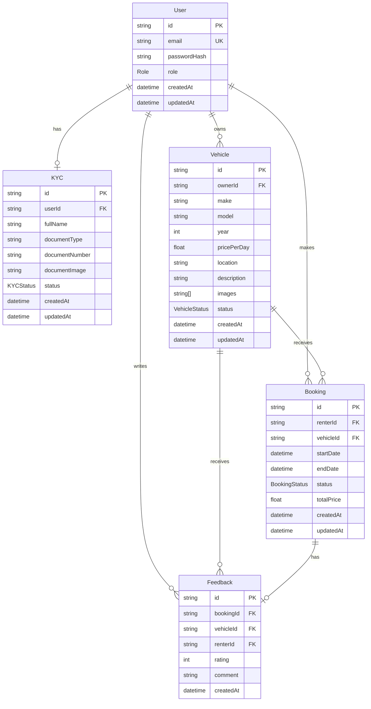
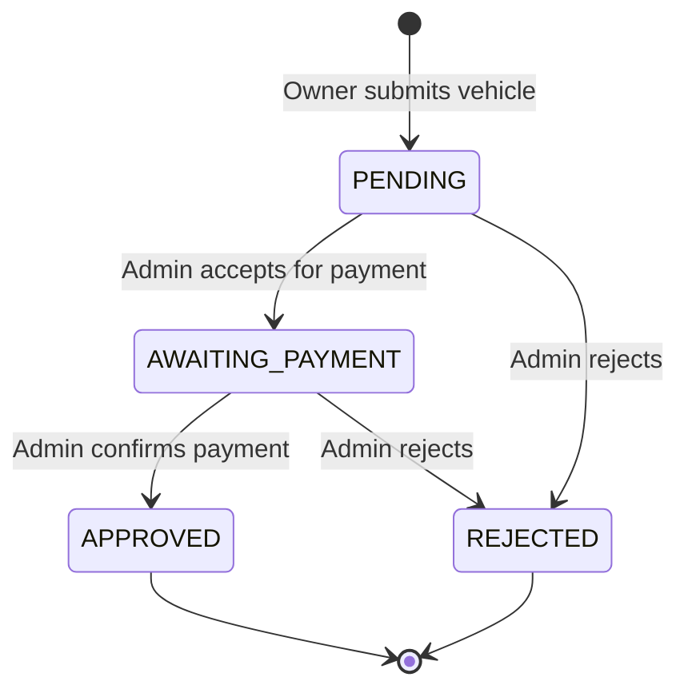
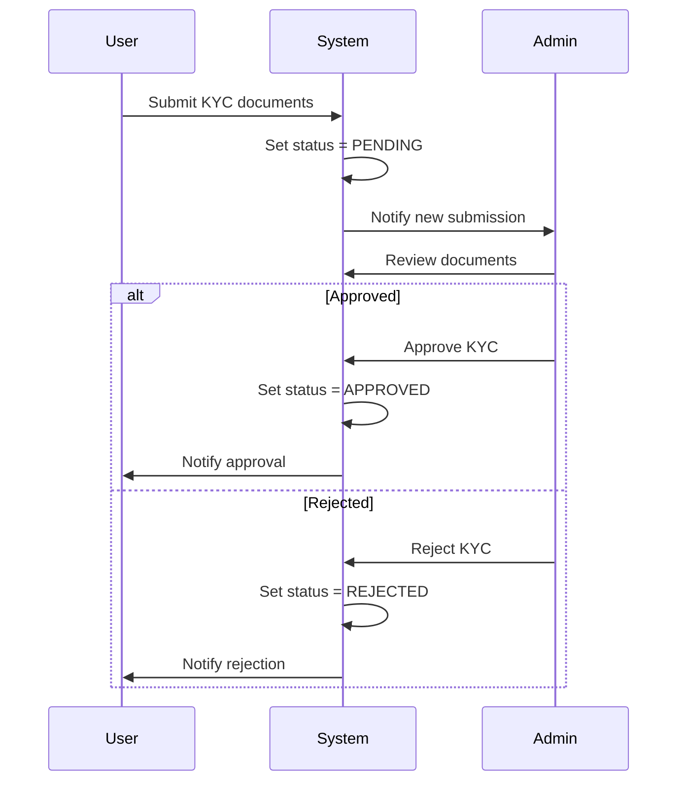

# Design Document: RentRide Vehicle Rental System

## Overview

RentRide is a full-stack vehicle rental platform built with Next.js 16 (App Router), TypeScript, Prisma ORM, and PostgreSQL. The system implements a three-tier role-based architecture (Admin, Owner, Renter) with comprehensive verification workflows for both users and vehicles.

The platform follows a feature-first architecture where each major domain (authentication, KYC, vehicles, bookings, admin) is organized as a self-contained feature module with its own API routes, components, and business logic.

### Key Design Principles

1. **Role-Based Access Control**: All routes and operations are protected by middleware that enforces role-based permissions
2. **Verification Workflows**: Multi-step approval processes for KYC and vehicle listings ensure platform integrity
3. **Conflict Prevention**: Booking system prevents double-bookings through date range validation
4. **Feature-First Organization**: Code is organized by business domain rather than technical layer
5. **Type Safety**: End-to-end type safety from database to UI using Prisma and TypeScript

### Technology Stack

- **Framework**: Next.js 16 with App Router
- **Language**: TypeScript
- **Database**: PostgreSQL with Prisma ORM
- **Authentication**: NextAuth.js
- **Styling**: TailwindCSS v4
- **State Management**: React Server Components + Client Components
- **Validation**: Zod for runtime validation

## Architecture

### System Architecture Diagram

```mermaid
graph TB
    subgraph "Client Layer"
        UI[React Components]
        AdminDash[Admin Dashboard]
        OwnerDash[Owner Dashboard]
        RenterDash[Renter Dashboard]
    end

    subgraph "Middleware Layer"
        Auth[Auth Middleware]
        RoleGuard[Role Guard]
    end

    subgraph "API Layer"
        AuthAPI[/api/auth]
        KYCAPI[/api/kyc]
        VehicleAPI[/api/vehicles]
        BookingAPI[/api/bookings]
        AdminAPI[/api/admin]
    end
```

    subgraph "Service Layer"
        AuthService[Authentication Service]
        KYCService[KYC Service]
        VehicleService[Vehicle Service]
        BookingService[Booking Service]
    end

    subgraph "Data Layer"
        Prisma[Prisma ORM]
        DB[(PostgreSQL)]
    end

    UI --> Auth
    AdminDash --> Auth
    OwnerDash --> Auth
    RenterDash --> Auth

    Auth --> RoleGuard
    RoleGuard --> AuthAPI
    RoleGuard --> KYCAPI
    RoleGuard --> VehicleAPI
    RoleGuard --> BookingAPI
    RoleGuard --> AdminAPI

    AuthAPI --> AuthService
    KYCAPI --> KYCService
    VehicleAPI --> VehicleService
    BookingAPI --> BookingService
    AdminAPI --> AuthService
    AdminAPI --> KYCService
    AdminAPI --> VehicleService

    AuthService --> Prisma
    KYCService --> Prisma
    VehicleService --> Prisma
    BookingService --> Prisma

    Prisma --> DB

```

### Folder Structure

```

src/
├── app/ # Next.js App Router
│ ├── (auth)/ # Auth route group
│ │ ├── login/
│ │ └── register/
│ ├── (dashboard)/ # Protected dashboard routes
│ │ ├── admin/
│ │ ├── owner/
│ │ └── renter/
│ ├── api/ # API routes
│ │ ├── auth/[...nextauth]/
│ │ ├── kyc/
│ │ ├── vehicles/
│ │ ├── bookings/
│ │ └── admin/
│ ├── layout.tsx
│ └── page.tsx
├── core/ # Shared core utilities
│ ├── lib/
│ │ ├── prisma.ts # Prisma client singleton
│ │ ├── auth.ts # NextAuth configuration
│ │ └── middleware.ts # Role-based middleware
│ ├── types/
│ │ └── index.ts # Shared types
│ └── utils/
│ └── validation.ts # Shared validators
├── features/ # Feature modules
│ ├── authentication/
│ │ ├── components/
│ │ ├── services/
│ │ └── types.ts
│ ├── kyc/
│ │ ├── components/
│ │ ├── services/
│ │ └── types.ts
│ ├── vehicles/
│ │ ├── components/
│ │ ├── services/
│ │ └── types.ts
│ └── bookings/
│ ├── components/
│ ├── services/
│ └── types.ts
└── generated/
└── prisma/ # Generated Prisma client

````

### Middleware Architecture

The middleware layer implements a two-stage protection mechanism:

1. **Authentication Check**: Verifies user has valid session
2. **Role Authorization**: Validates user role matches route requirements

```typescript
// Middleware execution flow
Request → Auth Check → Role Check → Route Handler
           ↓ fail       ↓ fail
        /login      403 Error
````

Route protection patterns:

- `/api/auth/*` - Public
- `/api/kyc/*` - Authenticated users only
- `/api/vehicles/*` - Role-specific (GET: all, POST: OWNER, PATCH: ADMIN)
- `/api/bookings/*` - Authenticated users with approved KYC
- `/api/admin/*` - ADMIN role only

## Components and Interfaces

### Feature Modules

#### Authentication Feature

**Components:**

- `LoginForm`: Email/password login with role display
- `RegisterForm`: Registration with role selection (ADMIN, OWNER, USER)
- `SessionProvider`: NextAuth session context wrapper

**Services:**

- `authService.register(email, password, role)`: Create new user account
- `authService.login(email, password)`: Authenticate user
- `authService.hashPassword(password)`: Bcrypt password hashing

#### KYC Feature

**Components:**

- `KYCSubmissionForm`: Form for users to submit KYC documents
- `KYCReviewPanel`: Admin interface to review pending KYC submissions
- `KYCStatusBadge`: Display KYC status (PENDING, APPROVED, REJECTED)

**Services:**

- `kycService.submitKYC(userId, data)`: Create KYC submission
- `kycService.getPendingSubmissions()`: Fetch all pending KYC for admin
- `kycService.approveKYC(kycId)`: Update status to APPROVED
- `kycService.rejectKYC(kycId)`: Update status to REJECTED
- `kycService.getUserKYCStatus(userId)`: Check if user has approved KYC

#### Vehicles Feature

**Components:**

- `VehicleListingForm`: Owner form to submit vehicle details
- `VehicleCard`: Display vehicle information with booking button
- `VehicleGrid`: Grid layout for browsing vehicles
- `VehicleReviewPanel`: Admin interface for vehicle verification
- `VehicleStatusBadge`: Display vehicle status

**Services:**

- `vehicleService.createVehicle(ownerId, data)`: Submit new vehicle listing
- `vehicleService.getApprovedVehicles(filters)`: Fetch vehicles for renters
- `vehicleService.getOwnerVehicles(ownerId)`: Fetch owner's vehicles
- `vehicleService.getPendingVehicles()`: Fetch vehicles needing admin review
- `vehicleService.acceptForPayment(vehicleId)`: Update to AWAITING_PAYMENT
- `vehicleService.confirmPayment(vehicleId)`: Update to APPROVED
- `vehicleService.rejectVehicle(vehicleId)`: Update to REJECTED

#### Bookings Feature

**Components:**

- `BookingRequestForm`: Form to request vehicle booking with date picker
- `BookingCard`: Display booking details and status
- `BookingList`: List bookings grouped by status
- `BookingActionButtons`: Owner actions (accept/reject)

**Services:**

- `bookingService.createBooking(renterId, vehicleId, startDate, endDate)`: Create booking request
- `bookingService.checkConflicts(vehicleId, startDate, endDate)`: Validate no overlapping bookings
- `bookingService.getRenterBookings(renterId)`: Fetch user's bookings
- `bookingService.getOwnerBookings(ownerId)`: Fetch bookings for owner's vehicles
- `bookingService.acceptBooking(bookingId)`: Update to CONFIRMED
- `bookingService.rejectBooking(bookingId)`: Update to REJECTED
- `bookingService.completeBooking(bookingId)`: Update to COMPLETED

### Dashboard Components

#### Admin Dashboard

- `AdminStats`: Display counts (pending KYC, pending vehicles, total users)
- `AdminNavigation`: Links to KYC review, vehicle review, user management
- `UserManagementTable`: View all users with roles and KYC status

#### Owner Dashboard

- `OwnerStats`: Display vehicle count, pending requests, active rentals
- `OwnerNavigation`: Links to add vehicle, manage vehicles, view bookings
- `VehicleManagementTable`: Owner's vehicles with status and actions

#### Renter Dashboard

- `RenterStats`: Display active bookings, completed rentals
- `RenterNavigation`: Links to browse vehicles, view bookings, profile
- `VehicleBrowser`: Search and filter available vehicles

### Shared UI Components

- `Button`: Styled button with variants (primary, secondary, danger)
- `Input`: Form input with validation states
- `Select`: Dropdown select component
- `Badge`: Status indicator component
- `Card`: Container component for content sections
- `Modal`: Dialog component for confirmations
- `LoadingSpinner`: Loading state indicator
- `ErrorMessage`: Error display component

## Data Models

### Database Schema

```prisma
// prisma/schema.prisma

generator client {
  provider = "prisma-client"
  output   = "../src/generated/prisma"
}

datasource db {
  provider = "postgresql"
}

enum Role {
  ADMIN
  OWNER
  USER
}

enum KYCStatus {
  PENDING
  APPROVED
  REJECTED
}

enum VehicleStatus {
  PENDING
  AWAITING_PAYMENT
  APPROVED
  REJECTED
}

enum BookingStatus {
  PENDING
  CONFIRMED
  REJECTED
  COMPLETED
}

model User {
  id            String    @id @default(cuid())
  email         String    @unique
  passwordHash  String
  role          Role
  createdAt     DateTime  @default(now())
  updatedAt     DateTime  @updatedAt

  kyc           KYC?
  vehicles      Vehicle[]
  bookings      Booking[]
  feedbacks     Feedback[]

  @@index([email])
  @@index([role])
}

model KYC {
  id            String      @id @default(cuid())
  userId        String      @unique
  user          User        @relation(fields: [userId], references: [id], onDelete: Cascade)

  fullName      String
  documentType  String
  documentNumber String
  documentImage String      // URL to uploaded document
  status        KYCStatus   @default(PENDING)

  createdAt     DateTime    @default(now())
  updatedAt     DateTime    @updatedAt

  @@index([status])
  @@index([userId])
}

model Vehicle {
  id            String        @id @default(cuid())
  ownerId       String
  owner         User          @relation(fields: [ownerId], references: [id], onDelete: Cascade)

  make          String
  model         String
  year          Int
  pricePerDay   Float
  location      String
  description   String?
  images        String[]      // Array of image URLs
  status        VehicleStatus @default(PENDING)

  createdAt     DateTime      @default(now())
  updatedAt     DateTime      @updatedAt

  bookings      Booking[]
  feedbacks     Feedback[]

  @@index([status])
  @@index([ownerId])
  @@index([location])
}

model Booking {
  id            String        @id @default(cuid())
  renterId      String
  renter        User          @relation(fields: [renterId], references: [id], onDelete: Cascade)
  vehicleId     String
  vehicle       Vehicle       @relation(fields: [vehicleId], references: [id], onDelete: Cascade)

  startDate     DateTime
  endDate       DateTime
  status        BookingStatus @default(PENDING)
  totalPrice    Float

  createdAt     DateTime      @default(now())
  updatedAt     DateTime      @updatedAt

  feedback      Feedback?

  @@index([status])
  @@index([renterId])
  @@index([vehicleId])
  @@index([startDate, endDate])
}

model Feedback {
  id            String    @id @default(cuid())
  bookingId     String    @unique
  booking       Booking   @relation(fields: [bookingId], references: [id], onDelete: Cascade)
  vehicleId     String
  vehicle       Vehicle   @relation(fields: [vehicleId], references: [id], onDelete: Cascade)
  renterId      String
  renter        User      @relation(fields: [renterId], references: [id], onDelete: Cascade)

  rating        Int       // 1-5 stars
  comment       String?

  createdAt     DateTime  @default(now())

  @@index([vehicleId])
  @@index([rating])
}
```

### Entity Relationships



### Data Constraints

1. **User Constraints**:
   - Email must be unique
   - Password must be hashed before storage
   - Role must be one of: ADMIN, OWNER, USER

2. **KYC Constraints**:
   - One KYC record per user (one-to-one relationship)
   - Status must be one of: PENDING, APPROVED, REJECTED
   - Cascade delete when user is deleted

3. **Vehicle Constraints**:
   - Owner must have OWNER or ADMIN role
   - Owner must have APPROVED KYC status
   - Status must be one of: PENDING, AWAITING_PAYMENT, APPROVED, REJECTED
   - Year must be valid (e.g., 1900-current year)
   - PricePerDay must be positive
   - Cascade delete when owner is deleted

4. **Booking Constraints**:
   - Renter must have USER role and APPROVED KYC
   - Vehicle must have APPROVED status
   - StartDate must be before EndDate
   - StartDate must be in the future (at creation time)
   - No overlapping bookings for same vehicle (enforced by service layer)
   - TotalPrice calculated as: (endDate - startDate) \* vehicle.pricePerDay
   - Cascade delete when renter or vehicle is deleted

5. **Feedback Constraints**:
   - One feedback per booking (one-to-one relationship)
   - Booking must have COMPLETED status
   - Rating must be between 1 and 5
   - Cascade delete when booking is deleted

## API Endpoints

### Authentication Routes

**POST /api/auth/register**

- Body: `{ email, password, role }`
- Response: `{ user: { id, email, role } }`
- Validation: Email format, password strength, valid role
- Creates user with hashed password

**POST /api/auth/[...nextauth]**

- NextAuth.js handlers for login, logout, session management
- Credentials provider with email/password
- JWT strategy for session tokens

### KYC Routes

**POST /api/kyc**

- Auth: Authenticated users
- Body: `{ fullName, documentType, documentNumber, documentImage }`
- Response: `{ kyc: { id, status } }`
- Creates KYC submission with PENDING status

**GET /api/kyc/status**

- Auth: Authenticated users
- Response: `{ status: KYCStatus | null }`
- Returns current user's KYC status

**GET /api/kyc/pending**

- Auth: ADMIN only
- Response: `{ submissions: KYC[] }`
- Returns all pending KYC submissions

**PATCH /api/kyc/:id/approve**

- Auth: ADMIN only
- Response: `{ kyc: { id, status } }`
- Updates KYC status to APPROVED

**PATCH /api/kyc/:id/reject**

- Auth: ADMIN only
- Response: `{ kyc: { id, status } }`
- Updates KYC status to REJECTED

### Vehicle Routes

**POST /api/vehicles**

- Auth: OWNER with APPROVED KYC
- Body: `{ make, model, year, pricePerDay, location, description, images }`
- Response: `{ vehicle: { id, status } }`
- Creates vehicle with PENDING status

**GET /api/vehicles**

- Auth: Public (filtered by role)
- Query: `?status=APPROVED&location=...&minPrice=...&maxPrice=...`
- Response: `{ vehicles: Vehicle[] }`
- Renters see only APPROVED vehicles
- Owners see their own vehicles
- Admins see all vehicles

**GET /api/vehicles/:id**

- Auth: Public
- Response: `{ vehicle: Vehicle, averageRating: number, feedbacks: Feedback[] }`
- Returns vehicle details with ratings

**GET /api/vehicles/owner/:ownerId**

- Auth: OWNER (own vehicles) or ADMIN
- Response: `{ vehicles: Vehicle[] }`
- Returns all vehicles for specific owner

**PATCH /api/vehicles/:id/accept-payment**

- Auth: ADMIN only
- Response: `{ vehicle: { id, status } }`
- Updates status to AWAITING_PAYMENT

**PATCH /api/vehicles/:id/confirm-payment**

- Auth: ADMIN only
- Response: `{ vehicle: { id, status } }`
- Updates status to APPROVED

**PATCH /api/vehicles/:id/reject**

- Auth: ADMIN only
- Response: `{ vehicle: { id, status } }`
- Updates status to REJECTED

### Booking Routes

**POST /api/bookings**

- Auth: USER with APPROVED KYC
- Body: `{ vehicleId, startDate, endDate }`
- Response: `{ booking: { id, status, totalPrice } }`
- Validates no conflicts, creates booking with PENDING status

**GET /api/bookings/renter**

- Auth: USER
- Response: `{ bookings: Booking[] }`
- Returns current user's bookings

**GET /api/bookings/owner**

- Auth: OWNER
- Response: `{ bookings: Booking[] }`
- Returns bookings for owner's vehicles

**PATCH /api/bookings/:id/accept**

- Auth: OWNER (vehicle owner)
- Response: `{ booking: { id, status } }`
- Updates status to CONFIRMED

**PATCH /api/bookings/:id/reject**

- Auth: OWNER (vehicle owner)
- Response: `{ booking: { id, status } }`
- Updates status to REJECTED

**PATCH /api/bookings/:id/complete**

- Auth: OWNER (vehicle owner)
- Response: `{ booking: { id, status } }`
- Updates status to COMPLETED (only if endDate has passed)

### Feedback Routes

**POST /api/bookings/:bookingId/feedback**

- Auth: USER (booking renter)
- Body: `{ rating, comment }`
- Response: `{ feedback: { id, rating } }`
- Creates feedback for COMPLETED booking

**GET /api/vehicles/:vehicleId/feedback**

- Auth: Public
- Response: `{ feedbacks: Feedback[], averageRating: number }`
- Returns all feedback for vehicle

### Admin Routes

**GET /api/admin/stats**

- Auth: ADMIN only
- Response: `{ pendingKYC: number, pendingVehicles: number, totalUsers: number }`
- Returns dashboard statistics

**GET /api/admin/users**

- Auth: ADMIN only
- Query: `?role=...&kycStatus=...`
- Response: `{ users: User[] }`
- Returns all users with filters

## Authentication & Authorization

### NextAuth Configuration

```typescript
// src/core/lib/auth.ts
import NextAuth from "next-auth";
import CredentialsProvider from "next-auth/providers/credentials";
import { PrismaAdapter } from "@auth/prisma-adapter";
import { prisma } from "./prisma";
import bcrypt from "bcryptjs";

export const { handlers, auth, signIn, signOut } = NextAuth({
  adapter: PrismaAdapter(prisma),
  session: { strategy: "jwt" },
  pages: {
    signIn: "/login",
  },
  providers: [
    CredentialsProvider({
      credentials: {
        email: { label: "Email", type: "email" },
        password: { label: "Password", type: "password" },
      },
      async authorize(credentials) {
        const user = await prisma.user.findUnique({
          where: { email: credentials.email },
          include: { kyc: true },
        });

        if (!user) return null;

        const isValid = await bcrypt.compare(
          credentials.password,
          user.passwordHash,
        );

        if (!isValid) return null;

        return {
          id: user.id,
          email: user.email,
          role: user.role,
          kycStatus: user.kyc?.status,
        };
      },
    }),
  ],
  callbacks: {
    async jwt({ token, user }) {
      if (user) {
        token.role = user.role;
        token.kycStatus = user.kycStatus;
      }
      return token;
    },
    async session({ session, token }) {
      session.user.role = token.role;
      session.user.kycStatus = token.kycStatus;
      return session;
    },
  },
});
```

### Middleware Implementation

```typescript
// src/middleware.ts
import { NextResponse } from "next/server";
import type { NextRequest } from "next/server";
import { auth } from "@/core/lib/auth";

export async function middleware(request: NextRequest) {
  const session = await auth();
  const { pathname } = request.nextUrl;

  // Public routes
  if (pathname.startsWith("/login") || pathname.startsWith("/register")) {
    return NextResponse.next();
  }

  // Auth check
  if (!session) {
    return NextResponse.redirect(new URL("/login", request.url));
  }

  // Role-based authorization
  const role = session.user.role;

  // Admin routes
  if (pathname.startsWith("/admin") || pathname.startsWith("/api/admin")) {
    if (role !== "ADMIN") {
      return NextResponse.json({ error: "Unauthorized" }, { status: 403 });
    }
  }

  // Owner routes
  if (
    pathname.startsWith("/owner") ||
    (pathname.startsWith("/api/vehicles") && request.method === "POST")
  ) {
    if (role !== "OWNER" && role !== "ADMIN") {
      return NextResponse.json({ error: "Unauthorized" }, { status: 403 });
    }
  }

  // KYC requirement for bookings
  if (pathname.startsWith("/api/bookings") && request.method === "POST") {
    if (session.user.kycStatus !== "APPROVED") {
      return NextResponse.json(
        { error: "KYC approval required" },
        { status: 403 },
      );
    }
  }

  return NextResponse.next();
}

export const config = {
  matcher: [
    "/admin/:path*",
    "/owner/:path*",
    "/renter/:path*",
    "/api/kyc/:path*",
    "/api/vehicles/:path*",
    "/api/bookings/:path*",
    "/api/admin/:path*",
  ],
};
```

### Role-Based Access Matrix

| Route Pattern      | ADMIN | OWNER        | USER         | Unauthenticated |
| ------------------ | ----- | ------------ | ------------ | --------------- |
| /login, /register  | ✓     | ✓            | ✓            | ✓               |
| /admin/\*          | ✓     | ✗            | ✗            | ✗               |
| /owner/\*          | ✓     | ✓            | ✗            | ✗               |
| /renter/\*         | ✓     | ✓            | ✓            | ✗               |
| GET /api/vehicles  | ✓     | ✓            | ✓            | ✓               |
| POST /api/vehicles | ✓     | ✓ (with KYC) | ✗            | ✗               |
| /api/bookings      | ✓     | ✓            | ✓ (with KYC) | ✗               |
| /api/admin/\*      | ✓     | ✗            | ✗            | ✗               |

## Key Algorithms

### Booking Conflict Detection Algorithm

```typescript
async function checkBookingConflicts(
  vehicleId: string,
  startDate: Date,
  endDate: Date,
  excludeBookingId?: string,
): Promise<boolean> {
  // Find all bookings for this vehicle that are not rejected
  const conflictingBookings = await prisma.booking.findMany({
    where: {
      vehicleId,
      status: {
        in: ["PENDING", "CONFIRMED", "COMPLETED"],
      },
      id: {
        not: excludeBookingId, // Exclude current booking for updates
      },
      OR: [
        // New booking starts during existing booking
        {
          AND: [
            { startDate: { lte: startDate } },
            { endDate: { gt: startDate } },
          ],
        },
        // New booking ends during existing booking
        {
          AND: [{ startDate: { lt: endDate } }, { endDate: { gte: endDate } }],
        },
        // New booking completely contains existing booking
        {
          AND: [
            { startDate: { gte: startDate } },
            { endDate: { lte: endDate } },
          ],
        },
      ],
    },
  });

  return conflictingBookings.length > 0;
}
```

**Algorithm Explanation:**

1. Query all bookings for the vehicle with active statuses (PENDING, CONFIRMED, COMPLETED)
2. Check for three overlap scenarios:
   - New booking starts during an existing booking
   - New booking ends during an existing booking
   - New booking completely encompasses an existing booking
3. Return true if any conflicts found, false otherwise

**Time Complexity**: O(n) where n is the number of bookings for the vehicle
**Space Complexity**: O(n) for storing query results

### Vehicle Approval Workflow State Machine

```typescript
type VehicleStatus = "PENDING" | "AWAITING_PAYMENT" | "APPROVED" | "REJECTED";

interface VehicleTransition {
  from: VehicleStatus;
  to: VehicleStatus;
  action: string;
  role: "ADMIN";
}

const vehicleWorkflow: VehicleTransition[] = [
  {
    from: "PENDING",
    to: "AWAITING_PAYMENT",
    action: "acceptForPayment",
    role: "ADMIN",
  },
  { from: "PENDING", to: "REJECTED", action: "reject", role: "ADMIN" },
  {
    from: "AWAITING_PAYMENT",
    to: "APPROVED",
    action: "confirmPayment",
    role: "ADMIN",
  },
  { from: "AWAITING_PAYMENT", to: "REJECTED", action: "reject", role: "ADMIN" },
];

async function transitionVehicleStatus(
  vehicleId: string,
  action: string,
  userRole: string,
): Promise<Vehicle> {
  const vehicle = await prisma.vehicle.findUnique({
    where: { id: vehicleId },
  });

  if (!vehicle) {
    throw new Error("Vehicle not found");
  }

  // Find valid transition
  const transition = vehicleWorkflow.find(
    (t) =>
      t.from === vehicle.status && t.action === action && t.role === userRole,
  );

  if (!transition) {
    throw new Error(
      `Invalid transition: ${action} from ${vehicle.status} for role ${userRole}`,
    );
  }

  // Execute transition
  return await prisma.vehicle.update({
    where: { id: vehicleId },
    data: { status: transition.to },
  });
}
```

**State Diagram:**



### KYC Verification Flow

```typescript
type KYCStatus = "PENDING" | "APPROVED" | "REJECTED";

async function submitKYC(userId: string, data: KYCData): Promise<KYC> {
  // Check if user already has KYC
  const existing = await prisma.kYC.findUnique({
    where: { userId },
  });

  if (existing && existing.status === "APPROVED") {
    throw new Error("User already has approved KYC");
  }

  // Create or update KYC submission
  return await prisma.kYC.upsert({
    where: { userId },
    create: {
      userId,
      ...data,
      status: "PENDING",
    },
    update: {
      ...data,
      status: "PENDING",
    },
  });
}

async function reviewKYC(kycId: string, approved: boolean): Promise<KYC> {
  return await prisma.kYC.update({
    where: { id: kycId },
    data: {
      status: approved ? "APPROVED" : "REJECTED",
    },
  });
}
```

**Flow Diagram:**


